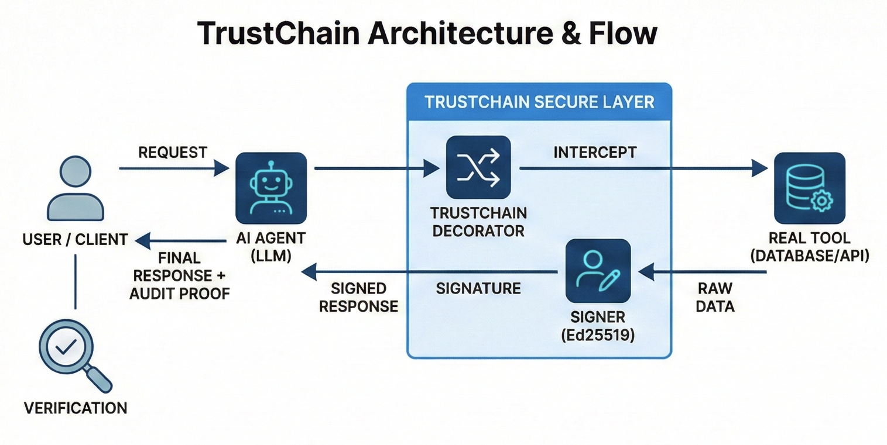
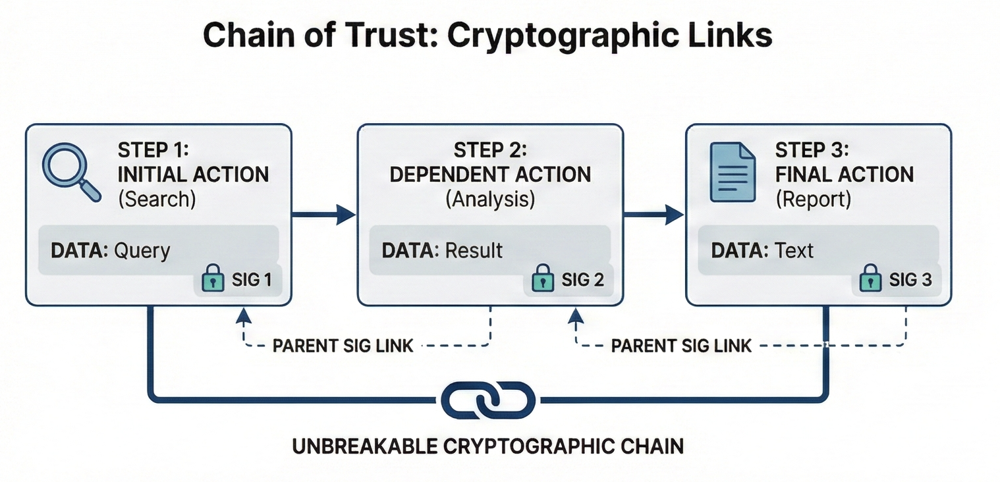
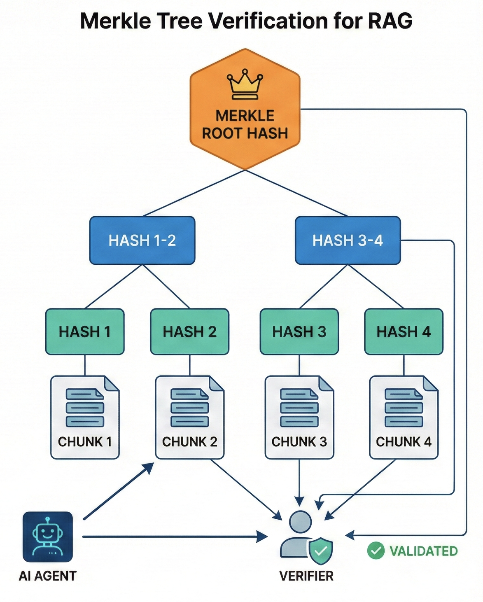

# TrustChain v2.4.0

**Cryptographic verification layer for AI agents — "Git for AI"**

> 💡 **AI either hallucinates facts or gets them from tools. TrustChain signs every fact from real tools. Signature = trust.**

[](https://github.com/petro1eum/trust_chain/actions/workflows/ci.yml)
[](https://www.python.org/downloads/)
[](LICENSE)

TrustChain adds **Ed25519 cryptographic signatures** to AI tool responses, enabling:

- **Proof of execution** — data came from a real tool, not hallucinated
- **Chain of Trust** — cryptographically linked operation sequences
- **Persistent storage** — Git-like `.trustchain/` directory with auditable history
- **CLI** — `tc log`, `tc verify`, `tc blame`, `tc status` commands
- **Tool certificates (PKI)** — SSL-like certificates for AI tools, code tamper detection
- **Replay attack protection** — nonce-based anti-replay
- **Key rotation** — seamless key management with persistence
- **Audit trails** — beautiful HTML reports for compliance
- **Integrations** — OpenAI, Anthropic, LangChain, MCP, FastAPI, Pydantic, OpenTelemetry



---

## Installation

We recommend using **uv** for lightning-fast installation:

```bash
uv pip install trustchain
```

Or using standard pip:

```bash
pip install trustchain
```

**Optional extras:**

```bash
uv pip install trustchain[integrations]  # LangChain + MCP support
uv pip install trustchain[ai]            # OpenAI + Anthropic + LangChain
uv pip install trustchain[mcp]           # MCP Server only
uv pip install trustchain[redis]         # Distributed nonce storage
uv pip install trustchain[fastapi]       # FastAPI middleware
uv pip install trustchain[all]           # Everything
```

---

## 🛡️ Enterprise Trust & Public Registry

While `trust_chain` lets you generate and verify signatures locally, how do external parties know they can trust *your* agent's public key?

**[TrustChain Platform](https://app.trust-chain.ai)** acts as a Root Certificate Authority (CA) for AI agents. Every registered agent receives a verifiable **X.509 Certificate** — the same model used by TLS/HTTPS, Apple App Store, and Let's Encrypt.

External developers can verify your agent's signatures with **Zero Trust** — no API keys, no data sent to our servers:

```python
import httpx
from cryptography.x509 import load_pem_x509_certificate, load_pem_x509_crl

BASE = "https://app.trust-chain.ai/api/pub"

# 1. Download agent cert + CA cert (.content = raw bytes, no encode needed)
agent_cert = load_pem_x509_certificate(httpx.get(f"{BASE}/agents/my-agent/cert").content)
ca_cert    = load_pem_x509_certificate(httpx.get(f"{BASE}/ca").content)
crl        = load_pem_x509_crl(httpx.get(f"{BASE}/crl").content)

# 2. Verify chain locally (trust math, not our API)
ca_cert.public_key().verify(agent_cert.signature, agent_cert.tbs_certificate_bytes)
assert crl.get_revoked_certificate_by_serial_number(agent_cert.serial_number) is None

# 3. Extract public key and verify signature — fully offline
agent_cert.public_key().verify(signature_bytes, data_bytes)
```

👉 **[Full verification guide →](docs/public-registry.md)**

---

## Quick Start

```python
from trustchain import TrustChain

tc = TrustChain()

@tc.tool("weather")
def get_weather(city: str) -> dict:
    return {"city": city, "temp": 22}

# Calling the function returns a SignedResponse
result = get_weather("Moscow")
print(result.data)       # {'city': 'Moscow', 'temp': 22}
print(result.signature)  # Ed25519 signature (Base64)

# Verify authenticity
assert tc.verify(result) == True
```

---

## Features

### Chain of Trust

Link operations cryptographically to prove execution order:



```python
step1 = tc._signer.sign("search", {"query": "balance"})
step2 = tc._signer.sign("analyze", {"result": 100}, parent_signature=step1.signature)
step3 = tc._signer.sign("report", {"text": "Done"}, parent_signature=step2.signature)

# Verify the entire chain
assert tc.verify_chain([step1, step2, step3]) == True
```

### Git-like Persistent Storage (v2.4.0)

Every signed operation is stored in a `.trustchain/` directory — like Git for AI:

```
.trustchain/
├── HEAD              # latest signature
├── config.json       # chain metadata
├── objects/          # one JSON file per signed operation
│   ├── op_0001.json
│   └── ...
├── refs/sessions/    # per-session HEAD pointers
└── certs/            # tool certificates (PKI)
```

```python
from trustchain import TrustChain, TrustChainConfig

tc = TrustChain(TrustChainConfig(
    chain_storage="file",   # "memory" | "file" | "sqlite"
    chain_dir=".trustchain"
))

tc.sign("bash_tool", {"command": "ls -la"})
tc.sign("search",    {"query": "TrustChain"})

# Git-like chain API
tc.chain.log()          # list all operations
tc.chain.verify()       # check chain integrity (fsck)
tc.chain.blame("bash")  # find ops by tool
tc.chain.status()       # health summary
tc.chain.head()         # current HEAD signature
```

### CLI — `tc` command (v2.4.0)

Git-like commands for incident investigation:

```bash
tc log                        # chain history (newest first)
tc log --tool bash_tool       # filter by tool
tc chain-verify               # verify chain integrity
tc blame bash_tool            # forensics: all ops by this tool
tc status                     # chain health summary
tc show op_0003               # single commit detail
tc diff op_0001 op_0005       # compare two operations
tc export audit.json          # export full chain
tc init                       # initialize .trustchain/
tc info                       # key + version
tc export-key --format=pem    # export public key
```

### Tool Certificates / PKI (v2.4.0)

SSL-like certificates for AI tools — verify tool code hasn't been tampered with:

```python
from trustchain import ToolRegistry, trustchain_certified

registry = ToolRegistry(registry_dir=".trustchain/certs")
registry.certify(my_tool, owner="DevOps", organization="Acme")

@trustchain_certified(registry)
def my_tool(query: str) -> dict:
    return {"result": query}

# If anyone modifies my_tool's code → UntrustedToolError!
registry.revoke(my_tool, reason="Security patch required")
```

### Key Management

```python
from trustchain import TrustChain, TrustChainConfig

# Persistent keys with auto-save
tc = TrustChain(TrustChainConfig(
    key_file="keys.json",
    enable_nonce=True
))
tc.save_keys()

# Key rotation (generates new keys)
old_key = tc.get_key_id()
new_key = tc.rotate_keys()  # Also saves if key_file is configured
print(f"Rotated from {old_key[:16]} to {new_key[:16]}")

# Export for external verification
public_key = tc.export_public_key()
```

### Multi-Tenant (Agent Isolation)

```python
from trustchain.v2.tenants import TenantManager

manager = TenantManager()

research_agent = manager.get_or_create("research_agent")
code_agent = manager.get_or_create("code_agent")

# Each agent has isolated keys - cannot verify each other's signatures
result = research_agent._signer.sign("data", {"value": 42})
assert research_agent.verify(result) == True
assert code_agent.verify(result) == False  # Different keys!
```

### OpenAI / Anthropic Schema Export

```python
# Get OpenAI-compatible function schema
schema = tc.get_tools_schema()

# Anthropic format
schema = tc.get_tools_schema(format="anthropic")
```

### 🔌 MCP Server — **Model Context Protocol** *(trending 🔥)*

```python
from trustchain.integrations.mcp import serve_mcp

@tc.tool("calculator")
def add(a: int, b: int) -> int:
    return a + b

serve_mcp(tc)  # Starts MCP server for Claude Desktop
```

### LangChain Integration

```python
from trustchain.integrations.langchain import to_langchain_tools

lc_tools = to_langchain_tools(tc)
# Use with LangChain AgentExecutor
```

### LangChain Callback Handler (v2.3.1)

Auto-sign all tool calls in LangChain agents:

```python
from trustchain.integrations.langsmith import TrustChainCallbackHandler

handler = TrustChainCallbackHandler(sign_inputs=True, sign_outputs=True)
result = agent.invoke("What's the weather?", config={"callbacks": [handler]})

# Get signed chain of all tool calls
for response in handler.get_signed_chain():
    print(f"{response.tool_id}: {response.signature[:24]}...")
```

### AsyncTrustChain (v2.3.1)

Native async/await support for FastAPI and other async frameworks:

```python
from trustchain.v2.async_core import AsyncTrustChain

async with AsyncTrustChain() as atc:
    response = await atc.sign_async("db_query", {"result": 42})
    assert atc.verify(response)
```

### Pydantic v2 Integration (v2.3.1)

Auto-signing Pydantic models:

```python
from trustchain.integrations.pydantic_v2 import TrustChainModel, SignedField

class UserProfile(TrustChainModel):
    user_id: str = SignedField(...)
    balance: float = SignedField(0.0)

user = UserProfile(user_id="U-123", balance=1000.0)
assert user.verify()  # True

user.balance = 999999  # Tampering!
assert user.verify()  # False - detected!
```

### OpenTelemetry Integration (v2.3.1)

Add TrustChain signatures to OTel spans:

```python
from trustchain.integrations.opentelemetry import TrustChainSpanProcessor
from opentelemetry.sdk.trace import TracerProvider

provider = TracerProvider()
provider.add_span_processor(TrustChainSpanProcessor())
# All spans now include trustchain.signature attribute
```

### pytest Plugin (v2.3.1)

Built-in fixtures for testing:

```python
# In conftest.py: pytest will auto-discover fixtures
from trustchain.pytest_plugin import tc, async_tc, signed_chain

def test_my_tool(tc):
    response = tc.sign("my_tool", {"result": 42})
    assert tc.verify(response)
```

### Merkle Trees for Large Documents



```python
from trustchain.v2.merkle import MerkleTree, verify_proof

pages = ["Page 1...", "Page 2...", ...]
tree = MerkleTree.from_chunks(pages)

# Verify single page without loading entire document
proof = tree.get_proof(42)
assert verify_proof(pages[42], proof, tree.root)
```

### CloudEvents Format

```python
from trustchain.v2.events import TrustEvent

event = TrustEvent.from_signed_response(result, source="/agent/bot")
kafka_headers = event.to_kafka_headers()
```

### Audit Trail UI

```python
from trustchain.ui.explorer import ChainExplorer

explorer = ChainExplorer(chain, tc)
explorer.export_html("audit_report.html")

# Export formats
json_data = explorer.to_json()  # Returns list of responses
stats = explorer.get_stats()     # Summary statistics
```

---

## Why TrustChain? (Before / After)

**❌ Without TrustChain:**
```python
# LLM hallucinates a tool response
result = {"balance": 1000000}  # Fake! Tool was never called
agent.send_to_user(result)     # User gets wrong data
```

**✅ With TrustChain:**
```python
# Every tool response is signed
result = get_balance("user_123")  # Returns SignedResponse

# Verification catches fakes
if not tc.verify(result):
    raise SecurityError("Invalid signature - possible hallucination!")
```

---

## Security Model

**TrustChain protects against:**
- ✅ LLM hallucinations (model invents tool output without calling it)
- ✅ Replay attacks (reusing old signed responses)
- ✅ Chain tampering (modifying execution order)

**TrustChain does NOT protect against:**
- ❌ Compromised infrastructure (if attacker has your private key)
- ❌ Prompt injection that tricks the *real* tool into returning malicious data

**Best practices:**
- Store private keys in **KMS/Vault/HSM**, not in code
- Use **Redis** nonce storage for production (in-memory = single instance only)
- Rotate keys periodically with `tc.rotate_keys()`

---

## Performance

| Operation | Latency | Throughput |
|-----------|---------|------------|
| Sign | 0.11 ms | 9,100 ops/sec |
| Verify | 0.22 ms | 4,500 ops/sec |
| Merkle (100 pages) | 0.18 ms | 5,400 ops/sec |

Storage overhead: ~124 bytes per operation.

---

## Interactive Examples

See the `examples/` directory:

| Notebook | Description |
|----------|-------------|
| [trustchain_tutorial.ipynb](examples/trustchain_tutorial.ipynb) | Basic tutorial + all v2.3.1 integrations |
| [trustchain_advanced.ipynb](examples/trustchain_advanced.ipynb) | Key persistence, multi-agent, Redis |
| [trustchain_llm.ipynb](examples/trustchain_llm.ipynb) | LLM integration examples |

**Python examples:**
- `mcp_claude_desktop.py` - MCP Server for Claude
- `langchain_agent.py` - LangChain integration
- `secure_rag.py` - RAG with Merkle verification
- `database_agent.py` - SQL with Chain of Trust
- `api_agent.py` - HTTP client with CloudEvents

---

## Architecture

```
trustchain/
  v2/
    core.py          # Main TrustChain class
    signer.py        # Ed25519 signatures
    chain_store.py   # Git-like ChainStore (v2.4)
    storage.py       # FileStorage, MemoryStorage (v2.4)
    certificate.py   # ToolCertificate, ToolRegistry, PKI (v2.4)
    config.py        # TrustChainConfig
    schemas.py       # OpenAI/Anthropic schema generation
    merkle.py        # Merkle tree implementation
    events.py        # CloudEvents format
    tenants.py       # Multi-tenant isolation
    nonce_storage.py # Memory/Redis nonce storage
    async_core.py    # AsyncTrustChain
    session.py       # TrustChainSession
    server.py        # REST API
  integrations/
    langchain.py     # LangChain adapter
    langsmith.py     # LangChain callback handler
    pydantic_v2.py   # Pydantic integration
    opentelemetry.py # OTel span processor
    mcp.py           # MCP Server
  cli.py             # tc command (12 commands) (v2.4)
  pytest_plugin/     # pytest fixtures
  ui/
    explorer.py      # HTML audit reports
```

---

## Use Cases

| Industry | Application |
|----------|-------------|
| **AI Agents** | Prove tool outputs are real, not hallucinations |
| **FinTech** | Audit trail for financial operations |
| **LegalTech** | Document verification with Merkle proofs |
| **Healthcare (HIPAA)** | Compliant AI data handling |
| **Enterprise** | SOC2-ready AI deployments |

---

## Documentation

| Language | Guide |
|----------|-------|
| 🇷🇺 Russian | [GUIDE_RU.md](GUIDE_RU.md) |
| 🇺🇸 English | [GUIDE_EN.md](GUIDE_EN.md) |
| 🇨🇳 Chinese | [GUIDE_ZH.md](GUIDE_ZH.md) |
| 🇪🇸 Spanish | [GUIDE_ES.md](GUIDE_ES.md) |
| 🇫🇷 French | [GUIDE_FR.md](GUIDE_FR.md) |
| 🇩🇪 German | [GUIDE_DE.md](GUIDE_DE.md) |
| 🇯🇵 Japanese | [GUIDE_JA.md](GUIDE_JA.md) |
| 🇰🇷 Korean | [GUIDE_KO.md](GUIDE_KO.md) |
| 🇧🇷 Portuguese | [GUIDE_PT.md](GUIDE_PT.md) |

- [Roadmap](ROADMAP.md) - Development roadmap
- [MCP Security Spec](docs/MCP_SECURITY_SPEC.md) - MCP integration details
- [GitHub Wiki](https://github.com/petro1eum/trust_chain/wiki) - Full API reference

---

## License

MIT

## Author

Ed Cherednik

## Version

2.4.0